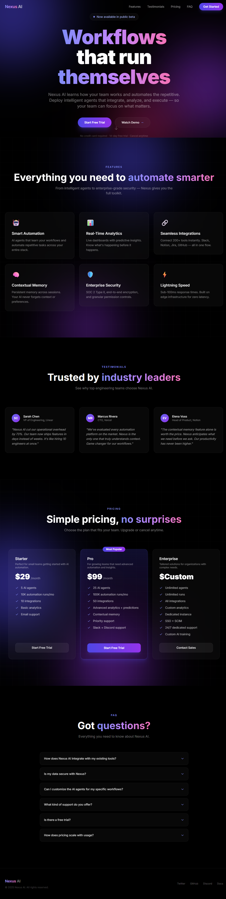
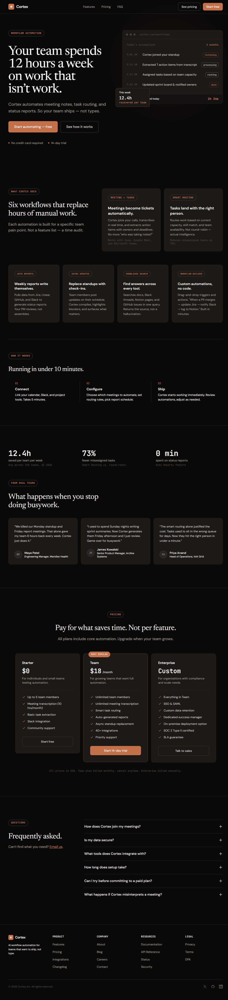

# zero-slop

<p align="center">
  
  
  
</p>

Two agent skills that flag and fix generic AI-generated UI patterns.

> **Repo:** [github.com/Eid0lon/zero-slop](https://github.com/Eid0lon/zero-slop)

- [What it does](#what-it-does)
- [What this is not](#what-this-is-not)
- [The two skills](#the-two-skills)
- [Install](#install)
- [Commands](#commands)
- [How they work together](#how-they-work-together)
- [What it looks for](#what-it-looks-for)
- [Example](#example)
- [Dials and presets](#dials-and-presets)
- [FAQ](#faq)
- [License](#license)

---

## What it does

AI coding agents tend to output the same visual cliches -- purple gradients, glass cards, "empower your workflow" copy, three feature cards in a centered hero. These are pattern-matched from training data, not designed for *your* product.

`no-slop` scans frontend code for these patterns and scores them. `perfect-design` helps define what the UI *should* be before any code gets written. They work together: `no-slop` blocks bad output, `perfect-design` builds the replacement.

---

## What this is not

- Not a replacement for a human designer.
- Not a visual AI model.
- Not a complete design system.
- Not a claim that every interface can be made perfect.
- Not a taste-skill replacement; it focuses on QA, review, and anti-generic checks.

---

## The two skills

### `no-slop` -- detect and fix generic UI

- Scans `.tsx`, `.jsx`, `.vue`, `.svelte`, `.css`, `.html` files for 15 categories of generic patterns
- Assigns a 0--100 slop score and names which "slop signatures" matched
- Runs a 6-role review protocol to decide if the UI passes
- Can do surgical fixes (`--fix`) or full rewrites (`--redesign`)
- Also works on briefs before code is generated (`--prevent`)

### `perfect-design` -- build product-specific UI

- Writes a Design Contract (user, job, domain, visual decisions) before touching code
- Has 6 product archetypes (operational SaaS, dashboard, commerce, portfolio, editorial, dev tool) to set expectations
- Scores UI against a 14-dimension rubric
- Composes with `no-slop` -- runs it before and after any design pass

---

## Install

```bash
npx skills add <url>
```

Then activate each skill you need in your agent.

## Commands

### `no-slop`

| Command | What it does |
|---|---|
| `--scan` | Scans frontend files and returns a 0--100 slop score |
| `--fix` | Surgical fixes on specific issues |
| `--redesign` | Full redesign when the score is too high |
| `--judge` | Runs the 6-role review protocol |
| `--prevent` | Audits a brief before any code is generated |
| `-e` | Economy mode -- deterministic checks only, no live judges |

### `perfect-design`

| Command | What it does |
|---|---|
| `--contract` | Writes a Design Contract from a brief |
| `--create` | Builds a new UI from a contract |
| `--redesign` | Rebuilds direction, layout, tokens, and copy |
| `--polish` | Refines an existing UI without changing the product model |
| `--judge` | Runs the premium review protocol |
| `--verify` | Build, lint, browser, and accessibility checks |
| `-e` | Economy mode -- deterministic checks only, no live judges |

---

## How they work together

```
1. perfect-design --contract     --  decide what the product is before code
2. no-slop --scan                --  check existing UI for generic patterns
3. perfect-design --create/polish--  build or refine the interface
4. no-slop --judge               --  verify no slop was introduced
5. perfect-design --judge        --  verify the result is product-specific
6. perfect-design --verify       --  build, lint, browser, a11y checks
```

If `no-slop` isn't available, `perfect-design` notes it and applies a local checklist. It never claims a pass it can't back up.

---

## What it looks for

Slop = UI that could belong to any product. A few things the scanner flags:

- Gradient heroes (blue-to-purple, indigo-to-pink)
- Glassmorphism cards with blur backgrounds
- Feature card grids with Sparkles/Shield/Rocket icons
- "Unlock seamless productivity" and similar copy
- Fake stats ("10K+ users", "99.9% uptime")
- `focus:outline-none` without replacement
- Hover scale/lift on every card
- Useless animations with no `prefers-reduced-motion`
- Raw hex colors bypassing design tokens

The full pattern database and scoring rules are in `skills/no-slop/references/ai-slop-patterns.md`.

---

## Example

Prompt:

> Build a modern, premium landing page for an AI SaaS that helps teams automate their productivity.
>
> Make it ultra professional, futuristic, with a clean and premium design. Include:
>
> - Hero section with big headline, powerful subheadline, and two CTA buttons
> - Features section with 6 cards
> - Testimonials section
> - Pricing tiers (3 plans)
> - FAQ
> - Footer
>
> Use React + Tailwind CSS. Modern style with gradients, glassmorphism, smooth animations, elegant dark mode. Make it visually stunning and convincing.
>
> Full code, responsive, ready to ship.

| Before | After |
|---|---|
|  |  |

---

## Dials and presets

Both skills use dials (0--10 sliders) that change how strict the checks are. A preset is just a bundle of dial values for a common product type.

| Preset | What it expects |
|---|---|
| `saas` | Product proof over marketing fluff, no fake dashboards |
| `dashboard` | Dense tables, clear filters, labeled charts, keyboard paths |
| `ecommerce` | Price/shipping clarity, real comparison, no fake scarcity |
| `portfolio` | Work evidence over trait cards, real case studies |
| `brutalist` | Deliberate rawness, not sloppy by accident |
| `minimal` | Fewer elements, sharper choices, high contrast |
| `editorial` | Typography, imagery, voice, pacing |
| `ai-tool` | Task controls, sources, constraints, error recovery |

---

## FAQ

<details>
<summary>Does this replace a human designer?</summary>
No. It flags generic output and enforces product-specific decisions, but it doesn't replace taste, strategy, or visual craft.
</details>

<details>
<summary>Do I need both skills?</summary>
No. `no-slop` works standalone for scanning and fixing generic patterns. `perfect-design` adds the Design Contract and premium rubric if you want both detection and direction.
</details>

<details>
<summary>Does it work with any framework?</summary>
Scans `.tsx`, `.jsx`, `.vue`, `.svelte`, `.astro`, `.css`, `.scss`, `.html`, and `.mdx`. The concepts apply to any stack -- you can run the CLI on any directory.
</details>

<details>
<summary>What's economy mode?</summary>
`-e` skips live subagent judges and uses deterministic local checks only. Same standards, lower cost. Useful for quick scans or when subagents aren't available.
</details>

<details>
<summary>Can I contribute or report issues?</summary>
Yes. This is an early public version. Open an issue, send a PR, or share before/after examples.
</details>

---

## License

[Apache 2.0](https://github.com/Eid0lon/zero-slop/blob/main/LICENSE)

Copyright (c) 2026
